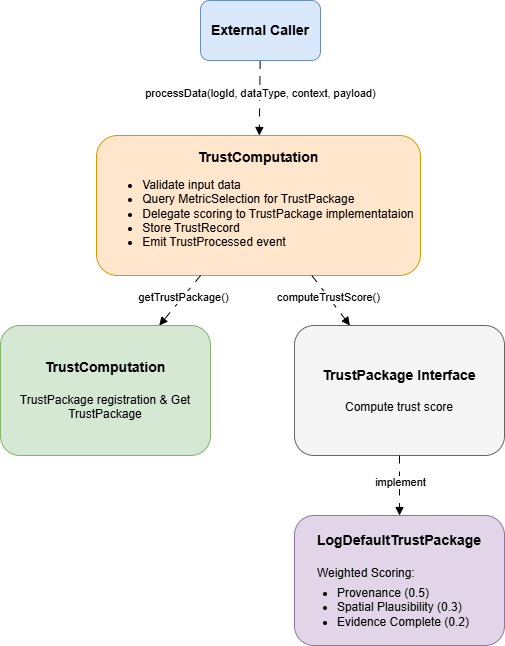

# Farmera Trustworthiness Smart Contract System

## Table of Contents
- [Project Overview](#project-overview)
- [Architecture](#architecture)
- [Smart Contracts](#smart-contracts)
- [Trust Scoring Algorithm](#trust-scoring-algorithm)

## Project Overview

The Farmera Trustworthiness Smart Contract is designed to compute and store trustworthiness scores for agricultural farm logs. The system evaluates the credibility of farm activity records by analyzing multiple dimensions including data provenance, spatial plausibility, and evidence completeness.

### Key Features

- **Pluggable Architecture**: Extensible trust scoring system supporting multiple scoring algorithms
- **Immutable Records**: Write-once trust records ensuring data integrity
- **On-Chain Verification**: Transparent and auditable trust computation on Ethereum blockchain

### Use Case

Agricultural stakeholders can submit farm activity logs to the smart contract. The system:
1. Validates the log data
2. Selects the appropriate trust scoring algorithm
3. Computes a trustworthiness score (0-100)
4. Stores the immutable record on-chain
5. Emits events for off-chain indexing

## Architecture

### Component Diagram


## Smart Contracts

### 1. TrustComputation.sol

**Location**: [src/TrustComputation.sol](src/TrustComputation.sol)

**Purpose**: Main contract responsible for processing farm logs and computing trust scores.

#### Data Structures

```solidity
struct TrustRecord {
    uint256 trustScore;  // Computed score (0-100)
    uint256 timestamp;   // Block timestamp of processing
}
```

#### Key Functions

##### `processData(uint64 logId, string dataType, string context, bytes data)`
Processes a farm log and computes its trustworthiness score.

**Parameters**:
- `logId`: Unique identifier for the farm log
- `dataType`: Type of data being processed (e.g., "agricultural_log")
- `context`: Context for trust evaluation (e.g., "harvest", "planting")
- `data`: ABI-encoded payload containing log details

**Process Flow**:
1. Queries MetricSelection for registered trust package
2. Validates trust package exists
3. Checks log hasn't been processed before
4. Validates data is non-empty
5. Delegates to trust package for score computation
6. Stores TrustRecord with timestamp
7. Emits TrustProcessed event

**Reverts**:
- `TrustComputation__NoTrustPackage`: No package registered for dataType+context
- `TrustComputation__IdAlreadyProcessed`: Log ID already processed
- `TrustComputation__InvalidData`: Empty data provided

#### Events

```solidity
event TrustProcessed(uint64 indexed logId, uint256 trustScore);
```

Emitted when a log is successfully processed. The indexed logId enables efficient querying.


### 2. MetricSelection.sol

**Location**: [src/MetricSelection.sol](src/MetricSelection.sol)

**Purpose**: Registry contract managing trust package registrations and lookups.

#### Key Functions

##### `registerTrustPackage(string dataType, string context, address addr)`
Registers a trust package for a specific data type and context combination.

**Parameters**:
- `dataType`: Type of data (e.g., "agricultural_log")
- `context`: Evaluation context (e.g., "harvest")
- `addr`: Address of TrustPackage implementation

**Reverts**:
- `MetricSelection__InvalidDataType`: Empty dataType or context
- `MetricSelection__InvalidAddress`: Zero address provided
- `MetricSelection__TrustPackageExisted`: Package already registered for this key

##### `getTrustPackage(string dataType, string context)`
Retrieves the registered trust package address.

**Returns**: `address` (returns address(0) if not found)

#### Events

```solidity
event TrustPackageRegistered(bytes32 indexed key);
```

### 3. TrustPackage.sol (Interface)

**Location**: [src/interfaces/TrustPackage.sol](src/interfaces/TrustPackage.sol)

**Purpose**: Standard interface for all trust scoring implementations.

```solidity
interface TrustPackage {
    function computeTrustScore(bytes calldata payload) external pure returns (uint256);
}
```

### 4. LogDefaultTrustPackage.sol

**Location**: [src/packages/LogDefaultTrustPackage.sol](src/packages/LogDefaultTrustPackage.sol)

**Purpose**: Default implementation of trust scoring for agricultural logs.

```solidity
uint256 constant MAX_DISTANCE = 100_000;  // ~100m in 1e6 scaled coordinates
uint256 constant MAX_IMAGE_COUNT = 1;
uint256 constant MAX_VIDEO_COUNT = 1;
uint256 constant SCALE = 100;

// Weights (must sum to 100)
uint256 constant WEIGHT_PROVENANCE = 50;
uint256 constant WEIGHT_SPATIAL_PLAUSIBILITY = 30;
uint256 constant WEIGHT_EVIDENCE_COMPLETENESS = 20;
```

See [Trust Scoring Algorithm](#trust-scoring-algorithm) section for detailed scoring logic.

## Trust Scoring Algorithm

The LogDefaultTrustPackage implements a weighted multi-metric scoring system.

### Scoring Formula

```
TrustScore = (Wp × Tp + Wsp × Tsp + Wec × Tec) / SCALE

Where:
  Wp  = Weight for Provenance (50)
  Wsp = Weight for Spatial Plausibility (30)
  Wec = Weight for Evidence Completeness (20)
  Tp  = Provenance score (0-100)
  Tsp = Spatial Plausibility score (0-100)
  Tec = Evidence Completeness score (0-100)
  SCALE = 100
```

### Metric Calculations

#### 1. Provenance Score (Tp) - 50% Weight

Evaluates whether the log has been verified by a trusted authority.

**Impact**: This is the highest weighted metric, emphasizing the importance of third-party verification.

---

#### 2. Spatial Plausibility Score (Tsp) - 30% Weight

Evaluates the distance between where the log was created and the expected farm plot location.

**Rationale**: Farmers should create logs at or near the farm plot location. Large deviations suggest fraudulent or erroneous submissions.

---

#### 3. Evidence Completeness Score (Tec) - 20% Weight

Evaluates the presence of supporting media (images/videos).

**Rationale**: Photographic/video evidence increases trustworthiness. The system expects up to 1 image and 1 video per log.

---

### Example Score Calculations

#### Example 1: High Trust Log
```
Input:
  verified = true
  imageCount = 1
  videoCount = 1
  distance = 10m (10,000 in scaled units)

Calculation:
  Tp = 100
  Tsp = ((100,000 - 10,000) × 100) / 100,000 = 90
  Tec = 100

  Score = (50 × 100 + 30 × 90 + 20 × 100) / 100
        = (5000 + 2700 + 2000) / 100
        = 97
```

#### Example 2: Medium Trust Log
```
Input:
  verified = false
  imageCount = 1
  videoCount = 0
  distance = 50m (50,000 in scaled units)

Calculation:
  Tp = 0
  Tsp = ((100,000 - 50,000) × 100) / 100,000 = 50
  Tec = 50

  Score = (50 × 0 + 30 × 50 + 20 × 50) / 100
        = (0 + 1500 + 1000) / 100
        = 25
```

#### Example 3: Low Trust Log
```
Input:
  verified = false
  imageCount = 0
  videoCount = 0
  distance = 120m (120,000 in scaled units)

Calculation:
  Tp = 0
  Tsp = 0 (exceeds MAX_DISTANCE)
  Tec = 0

  Score = 0
```

## File Tree

```
trustworthiness-smartcontract/
├── src/
│   ├── TrustComputation.sol              # Main processing contract
│   ├── MetricSelection.sol               # Package registry
│   ├── interfaces/
│   │   └── TrustPackage.sol              # Scoring interface
│   └── packages/
│       └── LogDefaultTrustPackage.sol    # Default scoring implementation
├── test/
│   ├── units/
│   │   ├── TrustComputationTest.t.sol
│   │   ├── MetricSelectionTest.t.sol
│   │   └── LogDefaultTrustPackageTest.t.sol
│   └── mocks/
│       └── MockTrustPackage.sol
├── script/
│   └── DeployTrustComputation.s.sol      # Deployment script
├── lib/
│   └── forge-std/                        # Foundry standard library
├── out/                                  # Compiled artifacts
├── cache/                                # Build cache
├── broadcast/                            # Deployment records
├── foundry.toml                          # Foundry config
├── Makefile                              # Build automation
├── .env                                  # Environment variables
├── .gitignore                            # Git ignore rules
├── .gitmodules                           # Submodule config
├── .github/workflows/test.yml            # CI/CD pipeline
└── README.md                             # Basic project info
```

### License

This project is licensed under the MIT License.

---

**Last Updated**: 2026-02-07
**Solidity Version**: ^0.8.30
**Foundry Version**: Latest stable
